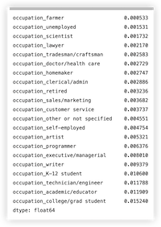
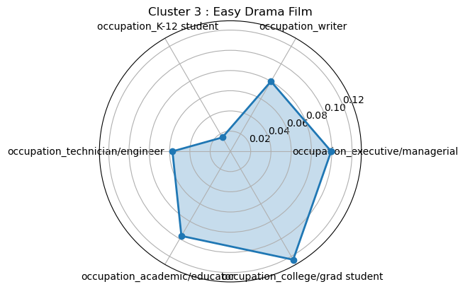

# MovieLens 电影数据分析

> 寿晨宸 2100012945

## Task 1 : 在movielens 1M的数据集上，统计分析观影的性别偏好

### 1.1 : 综合观影信息、评分信息，设计合理方案分别筛选出前20部比较流行的（rating > 300）男性/女性 偏好电影

1. 根据 ratings 筛选出评分数大于 300 的电影。
2. 筛选出流行电影的评分信息，并将评分信息与用户信息合并。
3. 计算出男性/女性观众对某部电影的平均评分。
4. 取出男性/女性用户评分最高的 20 部电影。

```python
# 筛选出评分数大于 300 的电影
movie_rating_count=ratings["movie_id"].value_counts()
popular_movies_id=movie_rating_count[movie_rating_count>300]
popular_movies=movies[movies["movie_id"].isin(popular_movies_id)]

# 分别统计男性和女性观众对电影的平均评分，筛选出前 20 部男性/女性偏好的电影
## 筛选出流行电影的评分信息
popular_movie_rating=pd.merge(ratings,popular_movies,on="movie_id")
## 将其评分信息与用户信息合并
popular_movie_user_rating=pd.merge(popular_movie_rating,users,on='user_id')
## 计算出男性/女性观众对某部电影的平均评分
average_ratings=popular_movie_user_rating.groupby(["gender","movie_id"])["rating"].mean().unstack()
## 取出男性/女性用户评分最高的 20 部电影
M_prefer_movies_id=average_ratings.loc["M"].sort_values(ascending=False)[:20]
F_prefer_movies_id=average_ratings.loc["F"].sort_values(ascending=False)[:20]
M_prefer_movies=pd.merge(M_prefer_movies_id,movies,on='movie_id').rename(columns={'M':'M_average_rating'})
F_prefer_movies=pd.merge(F_prefer_movies_id,movies,on='movie_id').rename(columns={'F':'F_average_rating'})
print("Male prefer these movies:")
display(M_prefer_movies)
print("Female prefer these movies:")
display(F_prefer_movies)
```

得到结果为：
Male prefer movies:

Female prefer movies:


### 1.2 : 针对不同类型的电影（genres），统计分析男/女偏好程度（需要做归一化），通过双色直方图对比显示

对于每种电影类型，计算男性和女性观众的偏好度，并进行归一化。

1. 处理电影类型(genres)的数据。将其以 ‘｜’ 分割，扩充 movies 矩阵。
2. 拼接 movies，ratings 和 users 矩阵，得到用户、评分和电影信息的综合信息矩阵。
3. 根据性别(gender)和电影种类(genres)统计看过某种电影的某种性别的人数。
4. 对人数做归一化处理。

```python
# 对于每种电影类型，计算男性和女性观众的偏好度，并进行归一化
## 处理电影类型的数据，做数据分割
movies_copy=movies.copy()
movies_copy["genres"]=movies_copy["genres"].str.split('|')
movies_copy=movies_copy.explode("genres")

# 整合拼接信息 
rating_movies_genres=pd.merge(ratings,movies_copy,on="movie_id")
rating_movies_users_genres=pd.merge(rating_movies_genres,users,on="user_id")

# 根据性别和电影种类计算看过某种电影的人数
genres_count=rating_movies_users_genres.groupby("gender")['genres'].value_counts()
count_F=genres_count['F']
count_M=genres_count['M']

# 对数据做归一化：
count_F_normalized=count_F/count_F.sum()
count_M_normalized=count_M/count_M.sum()
rating_movies_users_genres

# 可视化
plt.subplot()
plt.bar(count_F.index,count_F.to_list(),label='count_F')
plt.title("F-GERNES")
plt.xticks(rotation=90)
plt.legend()
plt.show()

plt.subplot()
plt.bar(count_M.index,count_M.to_list(),label='count_M')
plt.title("M-GERNES")
plt.xticks(rotation=90)
plt.legend()
plt.show()

plt.subplot()
x=np.arange(len(count_F_normalized.to_list()))
width=0.35
count_F_normalized=count_F_normalized.sort_index()
count_M_normalized=count_M_normalized.sort_index()
p1=plt.bar(x-width/2,count_F_normalized.to_list(),label="F",width=width)
p2=plt.bar(x+width/2,count_M_normalized.to_list(),label="M",width=width)
plt.title("genres_count")
plt.xticks(x,labels=count_F_normalized.index,rotation=90)
plt.legend()
plt.show()
```

可视化结果如下：

男性观众观看各种类电影数目：

女性观众观看各种类电影数目：

男性观众与女性观众观看各种类电影数目占比(归一化后)的对比：


## Task2 : 在movielens 1M的数据集上，通过观影及评分信息，预测观众的年龄-性别

### 2.1 : 拆分训练集-测试集（20%评测），实现评测方案（准确率-召回率）

#### 数据预处理

1. 筛选出观影数大于 100 的用户，以这些用户为基底构建用户-评分-电影信息的矩阵。
2. 将用户的性别编码为 0/1。
3. 将电影的种类编码为二进制特征向量(包含某种电影类型则向量中的对应元素值为 1)
4. 对年龄段做有序映射，将年龄值映射为整数。

```python
## 将所有信息综合在一起
data=pd.merge(pd.merge(ratings,users,on='user_id'),movies,on='movie_id')
print(data.shape)

## 选出观影数大于 100 的用户
user_rating_count=data['user_id'].value_counts()
active_users=user_rating_count[user_rating_count>100].index
data=data[data['user_id'].isin(active_users)]

## 编码性别
label_encoder = LabelEncoder()
data["gender"] = label_encoder.fit_transform(data["gender"])

## 先将每部电影的种类分解，再将每个分解后的特征编码为二进制，最后将得到的数值向量拼接回数据矩阵用于训练模型
genres = set()
for movie_genres in data["genres"].str.split("|"):
    genres.update(movie_genres)
genres = sorted(genres)
for genre in genres:
    data[genre] = data["genres"].str.contains(genre).astype(int)

## 对年龄段做有序映射
agedesc_map={'Under 18':0,'18-24':1,'25-34':2,'35-44':3,'45-49':4,'50-55':5,'56+':6}
agedesc_inv_map=['Under 18','18-24','25-34','35-44','45-49','50-55','56+']
mapped_age=data['age_desc'].apply(lambda x:agedesc_map[str(x).strip()])
mapped_age.name='mapped_age'

## 将映射后的特征值拼接回矩阵中
data = pd.concat([data, mapped_age], axis=1)

## 以评分和电影种类的编码向量作为判断依据，将用户性别和年龄段映射值作为预测目标
data=data.sort_values(by='user_id')
display(data)
```

得到的数据矩阵的部分信息如下：


#### 提取特征值和预测目标向量

因为训练分类器时，用户不应该有重复，所以需要提取用户的所有特征值作为训练时的数据，以及用户的性别/年龄作为预测的目标。

特征值：

1. Genres，计算用户观看每种电影类型的电影的数量
2. ratings，计算用户对于某种电影类型的平均评分，若未评分，则将其置为 0

目标向量：

1. age，用户原本的年龄段映射到的整数值。
2. gender，用户的性别。

```python
# 提取某个用户的所有特征
def extract_user_features(user_data):
    user_features=[]
    
    # age
    age=user_data["mapped_age"].iloc[0]
    # gender
    gender=user_data["gender"].iloc[0]

    # Genres，计算用户观看每种电影类型的电影的数量
    genres_features=user_data[genres].sum().tolist()
    user_features.extend(genres_features)
    
    # ratings，计算用户对于某种电影类型的平均评分，若未评分，则将其置为 0
    data_copy=user_data.copy()
    data_copy["genres"]=data_copy["genres"].str.split('|')
    data_copy=data_copy.explode("genres")
    rating_features=data_copy.groupby("genres")["rating"].mean()
    for id in genres:
        if id not in rating_features.index:
            rating_features[str(id)]=0
    rating_features=rating_features.sort_index()
    user_features.extend(list(rating_features))

    return (user_features,age,gender)

# 提取所有用户的特征值，作为训练数据
def extract_features(data):
    user_features=[]
    ages=[]
    genders=[]
    for user_id,user_data in data.groupby("user_id"):
        features,age,gender=extract_user_features(user_data)
        user_features.append(features)
        ages.append(age)
        genders.append(gender)
    user_features=pd.DataFrame(user_features)
    ages=pd.DataFrame(ages)
    genders=pd.DataFrame(genders)
    return (user_features,ages,genders)
```

#### 拆分训练集-测试集

通过提取特征值，将原本的信息矩阵转化为特征矩阵、用户年龄向量和用户性别向量。
拆分两次数据集，将特征矩阵作为 X，用户年龄/性别向量分别作为 y。

```python

# 得到的特征向量和预测目标值作为训练模型的 X 和 y
data_features,data_ages,data_genders=extract_features(data)
X_train_age,X_test_age,Y_train_age,Y_test_age=train_test_split(data_features,data_ages,test_size=0.2,random_state=42)
X_train_gender,X_test_gender,Y_train_gender,Y_test_gender=train_test_split(data_features,data_genders,test_size=0.2,random_state=42)

```

### 2.2 : 实现分类器模型，对观影数超过100的用户进行预测。调整模型及参数。包括并不限于特征降维来获得较好的效果

#### PCA 降维

使用 PCA 降维将用户的特征向量降到 10 维。

```python
# PCA 降维
pca=PCA(n_components=10,random_state=42)
X_age_pca=pca.fit_transform(pd.concat([X_train_age,X_test_age],axis=0))
X_train_age_pca=pd.DataFrame(X_age_pca[0:X_train_age.shape[0]])
X_test_age_pca=pd.DataFrame(X_age_pca[X_train_age.shape[0]:])

X_gender_pca=pca.fit_transform(pd.concat([X_train_gender,X_test_gender],axis=0))
X_train_gender_pca=pd.DataFrame(X_gender_pca[0:X_train_gender.shape[0]])
X_test_gender_pca=pd.DataFrame(X_gender_pca[X_train_gender.shape[0]:])
```

#### 实现 GaussianNB 分类器模型

```python
class GaussianNB(object):
    def __init__(self):
        pass
    def fit(self,X_train,Y_train):
        self._data_with_label=X_train.copy()
        self._Y_train=Y_train.copy()
        # 有监督数据
        self._data_with_label['label']=Y_train[0]
        # 每个类别的特征分布，均值
        self._mean_mat=self._data_with_label.groupby('label').mean()
        # 方差
        self._var_mat=self._data_with_label.groupby('label').var()
        # 统计先验类别
        self.prior_rate=self.__Priori()
        return self
    
    # 先验概率
    def __Priori(self):
        # label 计数
        labels=self._Y_train[0].value_counts().sort_index()
        # label 比例
        prior_rate=np.array([i/sum(labels) for i in labels])
        return prior_rate
    
    # 模型预测
    def predict(self,X_test):
        pred=[self.__Condition_formula(self._mean_mat,self._var_mat,row)*self.prior_rate for row in X_test.values]
        class_result=np.argmax(pred,axis=1)
        return class_result

    def __Condition_formula(self,mu,sigma2,row):
        from math import pi
        # 高斯函数计算先验
        P_mat=1/np.sqrt(2*pi*sigma2)*np.exp(-(row-mu)**2/(2*sigma2))
        # 返回一列的乘积
        P_mat=pd.DataFrame(P_mat).prod(axis=1)
        return P_mat
```

#### 对用户进行预测，并评测预测结果

1. 针对用户的年龄和性别分别训练两个 GaussianNB 分类器，并预测结果。
2. 使用准确率-召回率模型评测预测结果

```python
# 训练分类器
NB_age=GaussianNB()
NB_age.fit(X_train_age_pca,Y_train_age)
NB_gender=GaussianNB()
NB_gender.fit(X_train_gender_pca,Y_train_gender)

# 预测
y_pred_gender=NB_gender.predict(X_test_age_pca)
y_pred_age=NB_age.predict(X_test_gender_pca)

# 测评准确率/召回率
print(f"Accuracy score GENDER: {accuracy_score(Y_test_gender, y_pred_gender)}")
print(f"Recall score GENDER:{recall_score(Y_test_gender,y_pred_gender,average='weighted')}")

print(f"Accuracy score AGE: {accuracy_score(Y_test_age, y_pred_age)}")
print(f"Recall score AGE:{recall_score(Y_test_age,y_pred_age,average='weighted')}")
```

评测结果如下：


## Task 3 : 在movielens 1M的数据集上，通过观影-评分及电影简介等信息，对观影>100的用户实现用户画像

### 3.1 : 数据预处理

1. 筛选出观影数量大于100的活跃用户。
2. 筛选出这些用户的评分数据
3. 筛选出被这些用户观看过的电影
4. 将 movies 和 movie_info 矩阵拼接在一起，得到完整的电影信息。
5. 删除电影矩阵中未被活跃用户观看的电影。
6. 记录电影被观众评分的次数。
7. 构建用户-电影评分矩阵

```python
# 数据预处理
## 筛选出观影数量大于100的用户信息
user_rating_count=ratings["user_id"].value_counts()
active_users=user_rating_count[user_rating_count>100].index
## 筛选出这些用户的评分数据
active_user_ratings=ratings[ratings["user_id"].isin(active_users)]
## 筛选出被这些用户观看过的电影
active_user_movies=ratings[ratings["user_id"].isin(active_users)]["movie_id"]
## 将 movies 和 movie_info 矩阵拼接在一起
movies_merge=movies.merge(movies_info[["intro","directors","stars","movie_id"]],on="movie_id",how="outer")
## 删除电影矩阵中未出现在ratings矩阵里的电影id对应的行
movies_merge=movies_merge[movies_merge["movie_id"].isin(active_user_movies)]#.fillna("")
movies_merge=movies_merge.sort_values(by="movie_id")
## 记录电影被观众评分的次数
rating_counts=active_user_ratings["movie_id"].value_counts().sort_index()
rating_counts=pd.DataFrame(rating_counts).reset_index()
rating_counts=rating_counts.rename({"index":"movie_id","movie_id":"rating_count"},axis=1)

movies_merge=movies_merge.merge(rating_counts,on="movie_id")
## 构建用户-电影评分矩阵
user_movie_matrix=active_user_ratings.pivot_table(index="user_id",columns="movie_id",values="rating").fillna(0)
print("Movies table:")
display(movies_merge[0:5])
print("Movies shape: ",movies_merge.shape)
print("User-Movie Matrix shape: ",user_movie_matrix.shape)
display(user_movie_matrix[0:5])
```

处理后的数据如下：


### 3.2 特征工程

#### User-Movie 矩阵 SVD 降维

选取 k=50 作为 SVD 的参数，得到 U,Sigma,Vt 三个矩阵。
(Sigma@Vt).T 的大小是 (3670,50)，所以可以将其作为描述电影评分的特征值使用。

```python
# User-Movie 矩阵降维
## 进行SVD分解
U, sigma, Vt = svds(user_movie_matrix.to_numpy(), k=50)
print(U.shape,sigma.shape,Vt.shape)
## 构造对角矩阵
sigma = np.diag(sigma)
## 重构原始矩阵
user_movie_matrix_svd = U@sigma@Vt
## 得到电影评分的特征值
user_movie_features=((sigma@Vt).T)
```

#### TF-IDF 产生词向量

```python
# TF-IDF 特征
## 初始化 TF-IDF 向量器
vectorizer=TfidfVectorizer(max_features=100,stop_words="english")
## 计算 TF-IDF 值
tfidf_maxtrix=vectorizer.fit_transform(movies_merge["intro"].values.astype('U'))
## 结果转换为 DataFrame
text_semantic_vectors=pd.DataFrame(tfidf_maxtrix.toarray(),index=movies_merge["movie_id"])
```

词向量矩阵如下：


#### 特征融合

1. 将词向量融入特征矩阵。
2. 将降维 User-Movie 矩阵得到的特征值融入特征矩阵。
3. 对 1/2 两步得到的连续型特征做中心化-标准化处理。
4. 将电影类型信息转化为二进制特征向量，并整合进特征值。

```python
# 聚合电影的特征值
## 将 intro 词向量纳入特征值
movies_features=text_semantic_vectors.copy()

## 将用户的评分信息整合进特征值
user_rating_svd=pd.DataFrame((sigma@Vt).T)
movies_features=pd.concat([movies_features,user_rating_svd],axis=1).fillna(0)

# 特征的中心化-标准化处理
pca=PCA(n_components=40,random_state=42)
movies_features_pca=pca.fit_transform(movies_features)
movies_features_pca=pd.DataFrame(movies_features)

## 对连续型特征进行标准化 
scaler=MinMaxScaler()
movies_features_pca.columns=movies_features_pca.columns.astype(str)
movies_features_scaled=scaler.fit_transform(movies_features_pca)
print(movies_features_scaled.shape)

## 转换为 DataFrame
movies_features_scaled=pd.DataFrame(movies_features_scaled)
movies_features_scaled.columns=movies_features_scaled.columns.astype(str)

## 将电影类型转换为二进制特征向量
movies_merge_copy=movies_merge.copy()
genres = set()
for movie_genres in movies_merge_copy["genres"].str.split("|"):
    genres.update(movie_genres)
genres = sorted(genres)
for genre in genres:
    movies_merge_copy[genre] = movies_merge_copy["genres"].str.contains(genre).astype(int) 
movies_features_scaled[genres]=movies_merge_copy[genres]
movies_features_scaled=movies_features_scaled.fillna(0)

movies_features_scaled
```

得到特征矩阵如下：


#### 处理用户的特征信息

1. 使用 pandas 的 get_dummies 方法对用户的职业特征进行独热编码，并将独热编码的特征添加到用户数据表中。
2. 将用户性别编码为 0/1。
3. 将用户观看电影的数目整合进用户特征矩阵中。

```python
# 已标注特征处理方式（one-hot）
## 使用 pandas 的 get_dummies 方法进行独热编码
occupation_dummies=pd.get_dummies(users_active["occ_desc"],prefix="occupation")
## 将独热编码的特征添加到用户数据表中，并删除原始职业特征
users_temp=pd.concat([users_active.drop(columns=["occ_desc"]),occupation_dummies],axis=1)
## 编码性别
label_encoder = LabelEncoder()
users_temp["gender"] = label_encoder.fit_transform(users_temp["gender"])

## 将用户观看电影的数目整合进用户特征矩阵中
movie_counts=pd.DataFrame(user_rating_count.sort_index()).rename({"user_id":"movie_count"},axis="columns")
movie_counts["user_id"]=movie_counts.index
users_temp=users_temp.merge(movie_counts,on="user_id")

users_temp
```

得到用户特征矩阵：


### 3.3 K-means 电影聚类

在 K-means 聚类的过程中，为了使各个类别内的元素尽可能均匀分布，应当使类别的标准差保持在一个较小的范畴之内。

1. 对于K-means算法的聚类结果，可以使用np.bincount函数统计每个类别中的样本数量，并计算所有类别中样本数量的标准差。如果标准差比较小，则说明每个类别中的样本数量比较均匀。
2. 如果标准差比较大，可以根据每个类别中的样本数量，将数量较多的类别进行拆分，比如可以将数量最多的类别拆分为两个类别，然后重新执行K-means算法，直到达到预期的类别数量。

```python
# 确定聚类数量K
K = 5
X=movies_features_scaled
# 执行K-means聚类
kmeans = KMeans(n_clusters=K,n_init=100,init="k-means++",random_state=42).fit(X)
cluster_labels = kmeans.labels_

# 计算每个类别中的样本数量
counts = np.bincount(cluster_labels)

# 计算所有类别中样本数量的标准差
std = np.std(counts)

# 如果标准差比较大，则进行拆分操作
while std > 100:
    # 找到数量最多的类别
    max_count_idx = np.argmax(counts)
    # 将数量最多的类别拆分为两个类别
    mask = (cluster_labels == max_count_idx)
    X_max_count = X[mask]
    kmeans_max_count = KMeans(n_clusters=2,n_init=100,random_state=42,init="k-means++").fit(X_max_count)
    labels_max_count = kmeans_max_count.labels_
    cluster_labels[mask] = labels_max_count + K
    K += 1
    
    # 重新计算每个类别中的样本数量和标准差
    counts = np.bincount(cluster_labels)
    std = np.std(counts)

# 将得到的样本标签转化为 0,1,....,n
mp=dict(zip(np.unique(cluster_labels),range(len(counts[counts!=0]))))
for i in range(len(cluster_labels)):
    cluster_labels[i]=mp[cluster_labels[i]]
movies_merge["cluster"]=cluster_labels
display(movies_merge)
```

得到的电影分类信息如下：


### 3.4 电影聚类分析

#### 数据分析

1. 整合所有用户的评分数据和电影的信息。
2. 统计每一类电影中观众职业的分布，并做归一化。
3. 统计每种职业观看电影数量的方差，挑选方差较大的作为区分类别的主要特征。

```python
# 对每个类进行数据分析
## 整合所有用户的评分数据和电影的信息
data=(users_temp.merge(active_user_ratings,on="user_id")).merge(movies_merge,on="movie_id")
## 填充缺失值
data.fillna("")
## 统计每一类中某种职业的观众的数量，并做归一化
cluster_user_features=data.groupby("cluster")[occupation_dummies.columns].sum()
display(cluster_user_features)
cluster_user_features=cluster_user_features.div(cluster_user_features.sum(axis=1),axis=0)
display(cluster_user_features)

## 选出所有特征值中方差最大的进行展示
print((cluster_user_features.std(axis=0)).sort_values())
features=list((cluster_user_features.std(axis=0)).sort_values().index[-6:])
features
```

每一类中某种职业的观众数量：

归一化后的观众数量占比：

每种职业的方差：


#### 取出每种类别的代表电影

根据观看人数排序，取出观看人数最多的 5 部电影作为每种类别的代表电影。

```python
cluster_popular_movies=[]
display(movies_merge)
for i in range(len(np.unique(cluster_labels))):
    cluster_popular_movies.append(movies_merge[movies_merge["cluster"]==i].sort_values(by="rating_count")[-5:])
    display(cluster_popular_movies[i])
```

得到每种类别的代表电影如下：
cluser 0:

cluser 1:

cluser 2:

cluser 3:

cluser 4:

cluser 5:


#### 定性分析

观察观众职业分布和代表电影，为每种类别做标注，总结每种类别的特征。

- cluster 0 : Action Movie
- cluster 1 : Family Fun Movie/Children's Favorite
- cluster 2 : Horror Suspense Film
- cluster 3 : Easy Drama Film
- cluster 4 : Classic Film
- cluster 5 : Comedy Casual Film

```python
cluster_style={0: "Action Movie", 1: "Family Fun Movie/Children's Favorite", 2: "Horror Suspense Film", 3: "Easy Drama Film", 4: "Classic Film", 5: "Comedy Casual Film"}
```

#### 生成每个类的雷达图

```python
# 生成每个类的雷达图
def plot_rader_chart(labels,stats,name):
    labels=np.array(labels)
    stats=list(stats)
    angles=np.linspace(0,2*np.pi,len(labels),endpoint=False)
    stats=np.concatenate((stats,[stats[0]]))
    angles=np.concatenate((angles,[angles[0]]))
    fig=plt.figure()
    fig.tight_layout(pad=1.0)
    ax=fig.add_subplot(111,polar=True)
    ax.set_xticks(angles[:-1])
    ax.set_xticklabels(labels)
    ax.plot(angles,stats,'o-',linewidth=2)
    ax.fill(angles,stats,alpha=0.25)
    ax.set_title(name)
    
for i,row in enumerate(cluster_user_features.iterrows()):
    plot_rader_chart(features,row[1][features],f"Cluster {i} : {cluster_style[i]}")
plt.show()
```





### 3.3 用户画像

#### 统计用户特征

1. 统计用户观看过的每一类别的电影数量，并做归一化/标准化。
2. 找到每个观众最喜欢/最不喜欢的电影聚类。

```python
## 获取每个用户观看过的电影的聚类标签
user_cluster_counts=data.groupby("user_id")["cluster"].value_counts(normalize=True)
user_cluster_counts=pd.DataFrame(user_cluster_counts)
user_cluster_counts=user_cluster_counts.rename({"cluster":"count"},axis=1)
display(user_cluster_counts)

## 找到每个用户最喜欢和最不喜欢的电影聚类
user_fav_cluster=user_cluster_counts.loc[user_cluster_counts.groupby("user_id")["count"].idxmax()].drop(columns=["count"]).droplevel("user_id")
user_least_fav_cluster=user_cluster_counts.loc[user_cluster_counts.groupby("user_id")["count"].idxmin()].drop(columns=["count"]).droplevel("user_id")

users_temp["fav_cluster"]=(user_fav_cluster.index)
users_temp["least_fav_cluster"]=(user_least_fav_cluster.index)
print(users_temp["fav_cluster"].value_counts())
print(users_temp["least_fav_cluster"].value_counts())
display(users_temp)
```

用户观看过的每一类别的电影数量：

将某一类别视作最喜欢/最不喜欢的用户数量：


#### 生成用户画像

1. 生成用户观看过的每种类别电影数量的雷达图，作为观影偏好雷达图。
2. 给出用户最喜欢的电影类型和最讨厌的电影类型。
3. 选出用户观看最多的三类电影，从这三类的代表电影中分别选出 3/1/1 部电影作为用户偏好的代表电影。
4. 根据代表电影的 "intro" 和 "genres" 属性生成用户的偏好词云。

```python
# 生成用户偏好词云
def create_words_cloud(text):
    stopwords=list(STOPWORDS)+["Luke","Darth","Vader","year","one","two","three","four","five","six","seven","six","eight","nine","ten"]
    words=text
    wc=WordCloud(background_color="white",
                 stopwords=stopwords)
    wc.generate(words)
    fig=plt.figure()
    ax=fig.add_subplot()
    ax.imshow(wc)
    ax.axis("off")
    plt.show()

# 用户画像
## 生成用户观影偏好雷达图，并给出能表示用户观影偏好的 5 部代表性电影，根据这 5 部代表性电影，给出用户偏好词云
for i in range(3,10):
    id=users_temp.loc[i,'user_id']
    name=f"User {id} Preferences"
    labels=[cluster_style[i] for i in cluster_style]
    stats=(user_cluster_counts.loc[id])
    for j in range(len(labels)):
        if j not in stats.index:
            stats.loc[j]=0
    stats=stats.sort_index()
    plot_rader_chart(labels,stats.values,name)
    plt.show()

    ## 给出用户最喜欢的电影类型和最讨厌的电影类型
    fav_cluster=users_temp.loc[i,"fav_cluster"]
    least_fav_cluster=users_temp.loc[i,"least_fav_cluster"]
    print(f"Favorite Movie Cluster: {cluster_style[fav_cluster]}")
    print(f"Least Favorite Movie Cluster: {cluster_style[least_fav_cluster]}")

    print("Representative Movies:")
    ## 选出代表性的三类电影，
    represent_clusters=list((stats.sort_values(by="count").index)[-3:])
    ## 选出这两类电影中观看人次最多的 5 部电影
    represent_movies=pd.concat([cluster_popular_movies[represent_clusters[2]][-3:],cluster_popular_movies[represent_clusters[1]][-1:],cluster_popular_movies[represent_clusters[0]][-1:]],axis=0)
    display(represent_movies)

    ## 生成用户偏好词云
    print(f"User {id} Preferences Word Cloud: ")
    text_features=represent_movies["intro"].sum()+represent_movies["genres"].sum()
    create_words_cloud(text_features)
```

##### User 9

```text
Favorite Movie Cluster: Classic Film
Least Favorite Movie Cluster: Family Fun Movie/Children's Favorite
Representative Movies:

movie_id                                              title  \
284        296                                Pulp Fiction (1994)   
574        593                   Silence of the Lambs, The (1991)   
588        608                                       Fargo (1996)   
1093      1196  Star Wars: Episode V - The Empire Strikes Back...   
1165      1270                          Back to the Future (1985)   

                                 genres  \
284                         Crime|Drama   
574                      Drama|Thriller   
588                Crime|Drama|Thriller   
1093  Action|Adventure|Drama|Sci-Fi|War   
1165                      Comedy|Sci-Fi   

                                                  intro             directors  \
284   The lives of two mob hitmen, a boxer, a gangst...     Quentin Tarantino   
574   A young F.B.I. cadet must receive the help of ...        Jonathan Demme   
588   Jerry Lundegaard's inept crime falls apart due...  Joel Coen|Ethan Coen   
1093  After the Rebels are brutally overpowered by t...        Irvin Kershner   
1165  Marty McFly, a 17-year-old high school student...       Robert Zemeckis   

                                                stars  rating_count  cluster  
284       John Travolta|Uma Thurman|Samuel L. Jackson          1638        4  
574   Jodie Foster|Anthony Hopkins|Lawrence A. Bonney          1799        4  
588   William H. Macy|Frances McDormand|Steve Buscemi          1815        4  
1093          Mark Hamill|Harrison Ford|Carrie Fisher          2132        0  
1165    Michael J. Fox|Christopher Lloyd|Lea Thompson          1866        5 
```


##### User 10

```text
Favorite Movie Cluster: Comedy Casual Film
Least Favorite Movie Cluster: Easy Drama Film
Representative Movies:

movie_id                                              title  \
2488      2716                                Ghostbusters (1984)   
1160      1265                               Groundhog Day (1993)   
1165      1270                          Back to the Future (1985)   
1093      1196  Star Wars: Episode V - The Empire Strikes Back...   
588        608                                       Fargo (1996)   

                                 genres  \
2488                      Comedy|Horror   
1160                     Comedy|Romance   
1165                      Comedy|Sci-Fi   
1093  Action|Adventure|Drama|Sci-Fi|War   
588                Crime|Drama|Thriller   

                                                  intro             directors  \
2488  Three former parapsychology professors set up ...          Ivan Reitman   
1160  A weatherman finds himself inexplicably living...          Harold Ramis   
1165  Marty McFly, a 17-year-old high school student...       Robert Zemeckis   
1093  After the Rebels are brutally overpowered by t...        Irvin Kershner   
588   Jerry Lundegaard's inept crime falls apart due...  Joel Coen|Ethan Coen   

                                                stars  rating_count  cluster  
2488         Bill Murray|Dan Aykroyd|Sigourney Weaver          1633        5  
1160        Bill Murray|Andie MacDowell|Chris Elliott          1720        5  
1165    Michael J. Fox|Christopher Lloyd|Lea Thompson          1866        5  
1093          Mark Hamill|Harrison Ford|Carrie Fisher          2132        0  
588   William H. Macy|Frances McDormand|Steve Buscemi          1815        4  
```


##### User 11

```text
Favorite Movie Cluster: Comedy Casual Film
Least Favorite Movie Cluster: Family Fun Movie/Children's Favorite
Representative Movies:

movie_id                      title                genres  \
2488      2716        Ghostbusters (1984)         Comedy|Horror   
1160      1265       Groundhog Day (1993)        Comedy|Romance   
1165      1270  Back to the Future (1985)         Comedy|Sci-Fi   
588        608               Fargo (1996)  Crime|Drama|Thriller   
2628      2858     American Beauty (1999)          Comedy|Drama   

                                                  intro             directors  \
2488  Three former parapsychology professors set up ...          Ivan Reitman   
1160  A weatherman finds himself inexplicably living...          Harold Ramis   
1165  Marty McFly, a 17-year-old high school student...       Robert Zemeckis   
588   Jerry Lundegaard's inept crime falls apart due...  Joel Coen|Ethan Coen   
2628  A sexually frustrated suburban father has a mi...            Sam Mendes   

                                                stars  rating_count  cluster  
2488         Bill Murray|Dan Aykroyd|Sigourney Weaver          1633        5  
1160        Bill Murray|Andie MacDowell|Chris Elliott          1720        5  
1165    Michael J. Fox|Christopher Lloyd|Lea Thompson          1866        5  
588   William H. Macy|Frances McDormand|Steve Buscemi          1815        4  
2628          Kevin Spacey|Annette Bening|Thora Birch          2037        3  
```


##### User 13

```text
Favorite Movie Cluster: Action Movie
Least Favorite Movie Cluster: Easy Drama Film
Representative Movies:

movie_id                                              title  \
1107      1210  Star Wars: Episode VI - Return of the Jedi (1983)   
250        260          Star Wars: Episode IV - A New Hope (1977)   
1093      1196  Star Wars: Episode V - The Empire Strikes Back...   
1012      1097                  E.T. the Extra-Terrestrial (1982)   
2534      2762                            Sixth Sense, The (1999)   

                                   genres  \
1107  Action|Adventure|Romance|Sci-Fi|War   
250       Action|Adventure|Fantasy|Sci-Fi   
1093    Action|Adventure|Drama|Sci-Fi|War   
1012      Children's|Drama|Fantasy|Sci-Fi   
2534                             Thriller   

                                                  intro           directors  \
1107  After a daring mission to rescue Han Solo from...    Richard Marquand   
250   Luke Skywalker joins forces with a Jedi Knight...        George Lucas   
1093  After the Rebels are brutally overpowered by t...      Irvin Kershner   
1012  A troubled child summons the courage to help a...    Steven Spielberg   
2534  A boy who communicates with spirits seeks the ...  M. Night Shyamalan   

                                             stars  rating_count  cluster  
1107       Mark Hamill|Harrison Ford|Carrie Fisher          1939        0  
250        Mark Hamill|Harrison Ford|Carrie Fisher          2028        0  
1093       Mark Hamill|Harrison Ford|Carrie Fisher          2132        0  
1012      Henry Thomas|Drew Barrymore|Peter Coyote          1691        1  
2534  Bruce Willis|Haley Joel Osment|Toni Collette          1665        2  
```


##### User 15

```text
Favorite Movie Cluster: Classic Film
Least Favorite Movie Cluster: Family Fun Movie/Children's Favorite
Representative Movies:

movie_id                                              title  \
284        296                                Pulp Fiction (1994)   
574        593                   Silence of the Lambs, The (1991)   
588        608                                       Fargo (1996)   
1093      1196  Star Wars: Episode V - The Empire Strikes Back...   
1165      1270                          Back to the Future (1985)   

                                 genres  \
284                         Crime|Drama   
574                      Drama|Thriller   
588                Crime|Drama|Thriller   
1093  Action|Adventure|Drama|Sci-Fi|War   
1165                      Comedy|Sci-Fi   

                                                  intro             directors  \
284   The lives of two mob hitmen, a boxer, a gangst...     Quentin Tarantino   
574   A young F.B.I. cadet must receive the help of ...        Jonathan Demme   
588   Jerry Lundegaard's inept crime falls apart due...  Joel Coen|Ethan Coen   
1093  After the Rebels are brutally overpowered by t...        Irvin Kershner   
1165  Marty McFly, a 17-year-old high school student...       Robert Zemeckis   

                                                stars  rating_count  cluster  
284       John Travolta|Uma Thurman|Samuel L. Jackson          1638        4  
574   Jodie Foster|Anthony Hopkins|Lawrence A. Bonney          1799        4  
588   William H. Macy|Frances McDormand|Steve Buscemi          1815        4  
1093          Mark Hamill|Harrison Ford|Carrie Fisher          2132        0  
1165    Michael J. Fox|Christopher Lloyd|Lea Thompson          1866        5  
```


##### User 17

```text
Favorite Movie Cluster: Action Movie
Least Favorite Movie Cluster: Easy Drama Film
Representative Movies:

movie_id                                              title  \
1107      1210  Star Wars: Episode VI - Return of the Jedi (1983)   
250        260          Star Wars: Episode IV - A New Hope (1977)   
1093      1196  Star Wars: Episode V - The Empire Strikes Back...   
2534      2762                            Sixth Sense, The (1999)   
588        608                                       Fargo (1996)   

                                   genres  \
1107  Action|Adventure|Romance|Sci-Fi|War   
250       Action|Adventure|Fantasy|Sci-Fi   
1093    Action|Adventure|Drama|Sci-Fi|War   
2534                             Thriller   
588                  Crime|Drama|Thriller   

                                                  intro             directors  \
1107  After a daring mission to rescue Han Solo from...      Richard Marquand   
250   Luke Skywalker joins forces with a Jedi Knight...          George Lucas   
1093  After the Rebels are brutally overpowered by t...        Irvin Kershner   
2534  A boy who communicates with spirits seeks the ...    M. Night Shyamalan   
588   Jerry Lundegaard's inept crime falls apart due...  Joel Coen|Ethan Coen   

                                                stars  rating_count  cluster  
1107          Mark Hamill|Harrison Ford|Carrie Fisher          1939        0  
250           Mark Hamill|Harrison Ford|Carrie Fisher          2028        0  
1093          Mark Hamill|Harrison Ford|Carrie Fisher          2132        0  
2534     Bruce Willis|Haley Joel Osment|Toni Collette          1665        2  
588   William H. Macy|Frances McDormand|Steve Buscemi          1815        4 
```


##### User 18

```text
Favorite Movie Cluster: Action Movie
Least Favorite Movie Cluster: Horror Suspense Film
Representative Movies:

movie_id                                              title  \
1107      1210  Star Wars: Episode VI - Return of the Jedi (1983)   
250        260          Star Wars: Episode IV - A New Hope (1977)   
1093      1196  Star Wars: Episode V - The Empire Strikes Back...   
1012      1097                  E.T. the Extra-Terrestrial (1982)   
588        608                                       Fargo (1996)   

                                   genres  \
1107  Action|Adventure|Romance|Sci-Fi|War   
250       Action|Adventure|Fantasy|Sci-Fi   
1093    Action|Adventure|Drama|Sci-Fi|War   
1012      Children's|Drama|Fantasy|Sci-Fi   
588                  Crime|Drama|Thriller   

                                                  intro             directors  \
1107  After a daring mission to rescue Han Solo from...      Richard Marquand   
250   Luke Skywalker joins forces with a Jedi Knight...          George Lucas   
1093  After the Rebels are brutally overpowered by t...        Irvin Kershner   
1012  A troubled child summons the courage to help a...      Steven Spielberg   
588   Jerry Lundegaard's inept crime falls apart due...  Joel Coen|Ethan Coen   

                                                stars  rating_count  cluster  
1107          Mark Hamill|Harrison Ford|Carrie Fisher          1939        0  
250           Mark Hamill|Harrison Ford|Carrie Fisher          2028        0  
1093          Mark Hamill|Harrison Ford|Carrie Fisher          2132        0  
1012         Henry Thomas|Drew Barrymore|Peter Coyote          1691        1  
588   William H. Macy|Frances McDormand|Steve Buscemi          1815        4  
```


